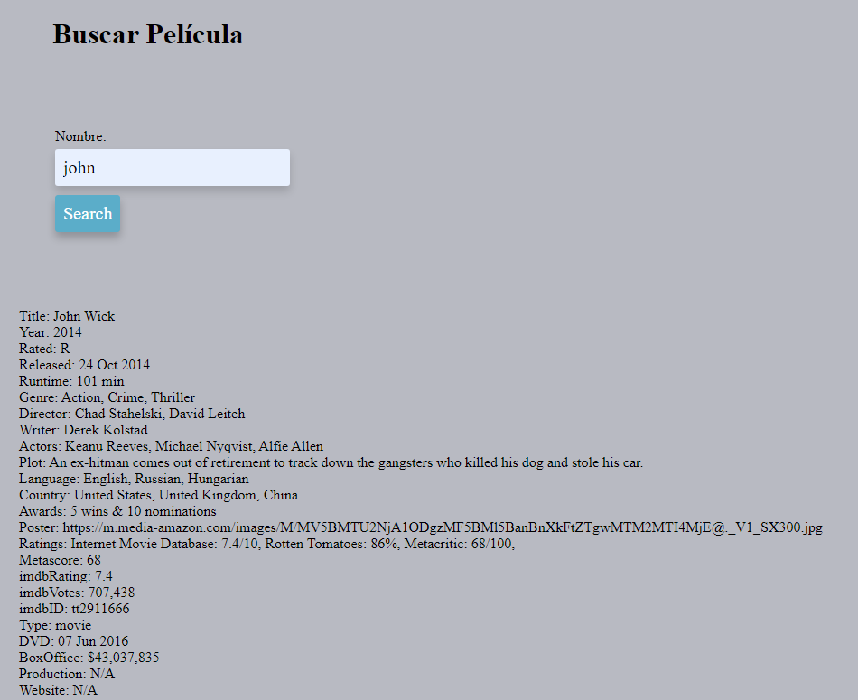
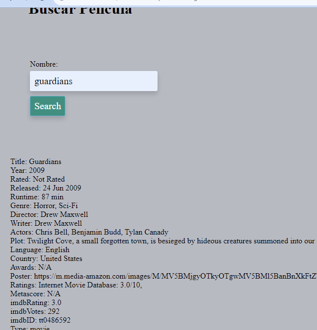
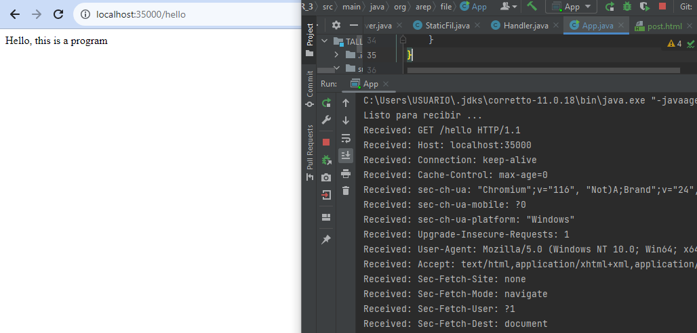
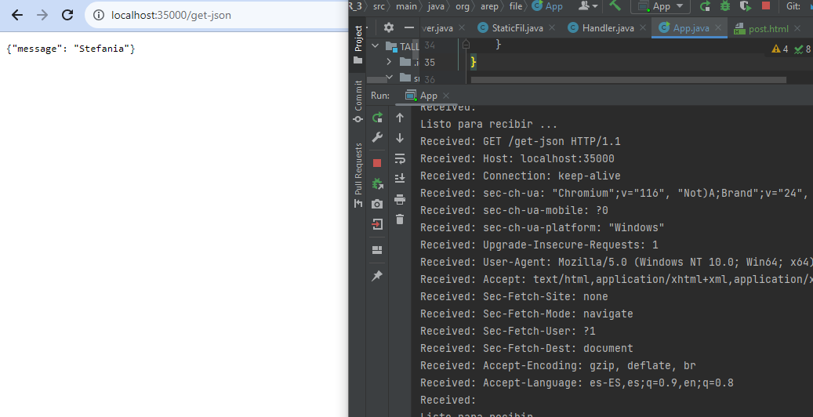
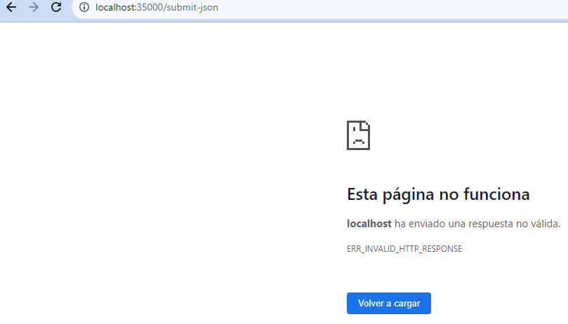

# Aplicaciones Distribuidas (HTTP, SOCKETS, HTML, JS,MAVEN, GIT)
##STEFANIA GIRALDO BUITRAGO
mediante la API https://omdbapi.com/ Se le pide que su implementación sea eficiente en cuanto a recursos 
así que debe implementar un Caché que permita evitar hacer consultas repetidas al API externo
La arquitectura debe tener las siguientes características.
###Installing
```
git clone https://github.com/stefania5964/taller3.git`
```

-El cliente Web debe ser un cliente asíncrono que corra en el browser  y use Json como formato para los mensajes.
-El servidor de servirá como un gateway para encapsular llamadas a otros servicios Web externos.
-La aplicación debe ser multiusuario.
-Todos los protocolos de comunicación serán sobre HTTP.
-Los formatos de los mensajes de intercambio serán siempre JSON.
-La interfaz gráfica del cliente debe ser los más limpia y agradableolo HTML y JS (Evite usar librerías complejas). Para invocar métodos REST desde el cliente usted puede utilizar la tecnología que desee.
-Debe construir un cliente Java que permita probar las funciones del servidor fachada. El cliente utiliza simples conexiones http para conectarse a los servicios. Este cliente debe hacer pruebas de concurrencia en su servidor de backend.
-La fachada de servicios tendrá un caché que permitirá que llamados que ya se han realizado a las implementaciones concretas con parámetros específicos no se realicen nuevamente. Puede almacenar el llamado como un String con su respectiva respuesta, y comparar el string respectivo. Recuerde que el caché es una simple estructura de datos.
-Se debe poder extender fácilmente, por ejemplo, es fácil agregar nuevas funcionalidades, o es fácil cambiar el proveedor de una funcionalidad.
-Debe utilizar maven para gestionar el ciclo de vida, git y github para almacenar al código fuente y heroku como plataforma de producción.
-En el backend debe utilizar solo Java. No puede utilizar frameworks como SPRING.
para usarlo se debe ingresar a un navegador de busqueda y colocar:
```
localhost:35000

````

y luego encontraremos esta pantalla a la cual se le hizo un diseño basico pero agradable al usuario
 en donde al presionar la tecla de busqueda cambia de color


luego podemos observar las diferentes busquedas que se realizaron







##Microframeworks WEB

En este taller usted debe explorar la arquitectura del microframework WEB denominado sparkweb (https://sparkjava.com/). Este micro framework permite construir aplicaciones web de manera simple usando funciones lambda.

Para este ejercicio usted deb construir un  servidor web para soportar una funcionalidad similar a la de Spark. Su aplicación debe permitir por lo menos el registro de servicios get y post usando funciones lambda. Implemente igualmente funciones que le permitan configurar el directorio de los archivos estáticos, y otra que permita cambiar el tipo de la respuesta a "application/json". Para esto solo debe usar el API básico de Java. No utilice frameworks como Spark o Spring.

* Su servidor debe:
-Permite configurar servicios web de tipo GET y POST usando funciones lambda.
-Entrega archivos estáticos como páginas HTML, CSS, JS e imágenes.
-Permite configurar el directorio de donde se leerán los archivos estáticos.
-Permite leer parámetros del query  desde los programas.
*Adicionalmente:

-Construya un ejemplo que muestre cómo de desarrollarían las aplicaciones en su servidor.
-Pruebe su proyecto , e incluya una prueba de su proyecto corriendo en al menos dos sistemas operativos diferentes (Windows y linux)

### GET y POST
en este caso el recurso hello nos devolvera 

```
Hello, this is a program
```


luego permite cambiar el tipo de la respuesta a "application/json".
en este caso el recurso  get-json nos devolvera 

```
{"message": "Stefania"}
```



falta implementar mejor el post 



